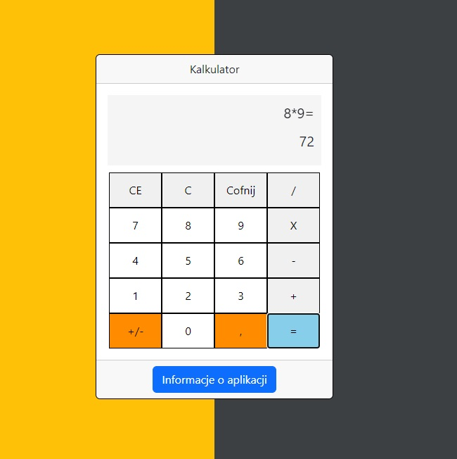

# :desktop_computer: Calculator

The application allows the user to enter selected mathematical operations (e.g. addition, subtraction, multiplication, division) and numbers to be subjected to these operations. After entering the data, the application performs the calculations and displays the result on the screen.

## :framed_picture: Screenshots

## :joystick: Demo

https://kamilkeder.github.io/PasswCalculatorordGenerator/

## :e-mail: Feedback

If you have any feedback, please reach out to me at kontaktkkeder@gmail.com
